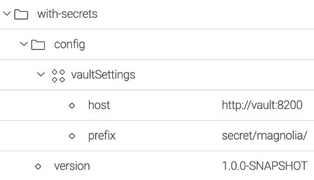
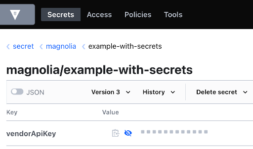
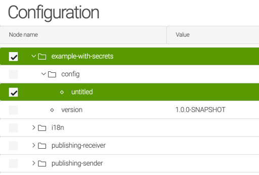
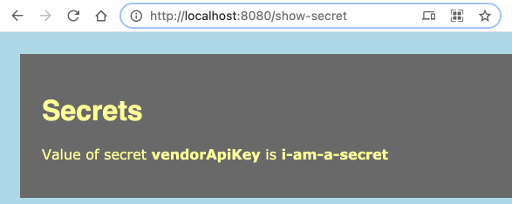

# magnolia-with-secrets
Configuration of magnolia modules is stored in JCR database, if the configuration contains sensible data - passwords, api keys etc. - it can be a lack of security.  
To solve the above issue, sensible data should be stored in a Secret Manager as [Vault](https://www.vaultproject.io/)

## Features
- Integration with Secrets manager: Hashicorp Vault, AWS Secrets manager (to be done) and Google Secret manager (to be done).
- Population of secrets in configuration of modules.

## Content
### with-secrets
Maven module that implements the integration with Secrets managers and loads module configuration.
### magnolia-with-secrets-bundle-webapp
Magnolia bundle to check the module *with-secrets*.
### example-with-secrets
Example of magnolia module using the module *with-secrets* to get secrets from a Secret Manager. 

## Usage
Add dependency with the module *with-secrets*
```xml
<dependency>
    <groupId>com.formentor</groupId>
    <artifactId>with-secrets</artifactId>
    <version>${project.version}</version>
</dependency>
```

Extends the module class with *ModuleConfigSecrets*  
```java
public class ExampleWithSecrets extends ModuleConfigSecrets {

    private String vendorApiKey;

    @Inject
    public ExampleWithSecrets(WithSecrets withSecrets, SecretsStorageFactory secretsStorageFactory, PreConfiguredBeanUtils beanUtils, MagnoliaConfigurationProperties magnoliaConfigurationProperties) {
        super(withSecrets, secretsStorageFactory, beanUtils, magnoliaConfigurationProperties);
    }
}
```
> See *example-with-secrets* 
## Setup
Secrets can be stored in [Vault](https://www.vaultproject.io/), [AWS Secrets Manager](https://aws.amazon.com/secrets-manager/) and [Google Secret Manager](https://cloud.google.com/secret-manager), and depending on the origin the configuration will be different. 
### Using Hashicorp Vault
[Vault](https://www.vaultproject.io/) is a product from [Hashicorp](https://www.hashicorp.com/) to store and manage secrets.
1. Set variable *VAULT_TOKEN* with the token in Vault.
```shell
export VAULT_TOKEN=myroot
```
2. Configure Vault *with-secrets*  

   
**host** with the address of the Vault server  
**prefix** prefix or path of the modules of magnolia in Vault. The prefix is added to the module name to get the configuration.

### Using AWS Secrets Manager (to be done)
> The implementation of the integration with [AWS Secrets Manager](https://aws.amazon.com/secrets-manager/) has to bee done.

### Using Google Secret Manager (to be done)
> The implementation of the integration with [Google Secret Manager](https://cloud.google.com/secret-manager) has to bee done.

## Demo with Vault
The project provides a *docker-compose* that starts a *Vault Server* and a *Magnolia instance* with the module **example-with-secrets** whose configuration is stored in [Vault](https://www.vaultproject.io/).
#### 1. Start Hashicorp Vault and Magnolia using the docker-compose definition of the projet
```
$ docker compose up -d
```

#### 2. Add the secret "vendorApiKey" for the module *example-with-secrets* in [Vault](https://www.vaultproject.io/)
a) Using Vault cli  
```shell
# Adds "vendorApiKey" with the value "i-am-a-secret"
docker exec -ti magnolia-with-secrets-bundle_vault_1 sh -c "vault kv put secret/magnolia/example-with-secrets vendorApiKey=i-am-a-secret"
```

b) Using Vault ui
> http://localhost:8200/ui using token "myroot"


#### 3. Restart the module example-with-secrets
Restart the module *example-with-secrets* to load the new configuration from Vault.  
a) Restarting the container of Magnolia
```shell
$ docker stop magnolia-with-secrets-bundle_magnolia_1
$ docker start magnolia-with-secrets-bundle_magnolia_1
```

b) Changing the configuration of the module
> Magnolia is exposed in http://locahost:8080/.magnolia

You can create a dummy property to trigger the starting of *example-with-secrets* 



#### 4. Open the page show-secret
The page *show-secret* of Magnolia shows the value of the property "vendorApiKey" of the module *example-with-secrets*.  
As you will see the value matches the entry "vendorApiKey" of the secret "secret/magnolia/example-with-secret" in [Vault](https://www.vaultproject.io/) 
> http://localhost:8080/show-secret


## Insights
### How to implement integration with Secrets manager
Implements the integration with the Secret manager implementing the interface Extend the SecretsStorage and implement the method readModuleConfig()

```java
import java.util.HashMap;

public class SecretsStorageImpl implements SecretsStorage {
    @Override
    public Map<String, String> readModuleConfig(String module) {
        return new HashMap<>();
    }
}
```
Creates a method in the factory of secret managers to instantiate the secret manager
```java
public class SecretsStorageFactory {
    /**
     * Returns an instance of SecretsStorage implemented for the secret manager
     * @param config
     * @param magnoliaConfigurationProperties
     * @return
     */
    public SecretsStorage getSecretsStorageAWS(SecretSettings config, MagnoliaConfigurationProperties magnoliaConfigurationProperties) {
        return new SecretsStorageImpl();
    }
}
```